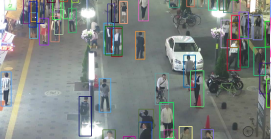
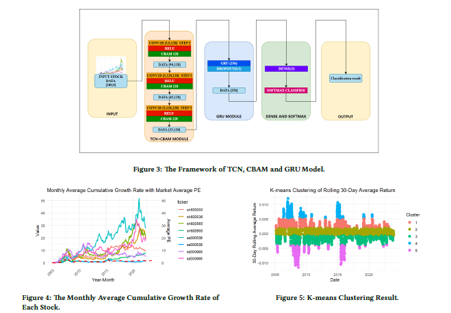

Hello, Welcome to my page. I'm now a final year undergraduate student of Software Engineering in [Shandong University of Science and Technology](https://www.sdust.edu.cn/). My research interest focus on leveraging DL for complex time series data, such as pulse data, and computer vision. I am very fortunate to be advised by [Prof. Yanfang, Yin](https://orcid.org/0000-0003-3510-3862) of Information Systems Integration Laboratory.

## Research

  
  

    
MOT （Current Research)

    
 
      Improve the existing Multiple Object Tracking(MOT) models and add human skeleton point recognition to the model.
    

  

  
  

    
TCN and GRU-Based Lumbar Disc Disease Detection

    
 
      Developed an intelligent model for diagnosing lumbar disc disease using deep learning to address noise and complexity inherent in traditional Chinese pulse wave data. Identified TCN+GRU model as optimal, achieving approximately 81% accuracy through 16-fold cross-validation, enhanced the accuracy of traditional Chinese pulse diagnostics in lumbar disc disease detection. Drafted sections of related papers detailing experimental workflows, and data analysis, with one manuscript currently under peer review as a third author in a JCR Q1 journal
    

  

  
  

    
Quadruped bionic robot

    
 
    Our tasks are let the quadruped bionic robot has the abilities to patrol lines, recognize and avoid height limit poles, go up stairs, go down stairs and delivery express. We write a recognition algorithm – which aims to recognize the base line, obstacles and missions – based on OPENCV and utilized the posture control algorithm to control the robot.
    

  

  
  

    
Modeling between Low Turnover Stocks and SSE Index Based on Neural Network

    
 
      Designed a deep learning model with innovative TCN+CBAM+GRU architecture, integrating three-layer 1D convolution, CBAM attention and GRU units for sequence data in financial analysis.Achieved an exceptional test accuracy of 83.75% in predicting SSE Index trends, with test and training accuracies of 84.96% and 91.35%, respectively.Wrote the manuscript on this project, accepted by the 2024 4th International Conference on Artificial Intelligence, Big Data, and Algorithms (CAIBDA 2024).
    

    
  

## Publications
----
1. **Time Series Modeling of the Relationship between Low Turnover Stocks and SSE Index Based on Neural Network** ICAIBA2024
Ma, X.*, **Wang, H.*** 2024, June. [Page](https://dl.acm.org/doi/10.1145/3690407.3690554)

2.	**Smart Group Attendance System Based on Face Recognition** IECAI2024 **Wang, H.**  2024, May [Page](https://ieeexplore.ieee.org/document/10674833)

3.	**Study on the Characteristic Sound Wave of Lumbar Disc Herniation by Pulse Sound Wave** Yameng Zhang, Mengqi Gao, **Haoyang Wang**, et al.  Submit to Computer Methods and Programs in Biomedicine(under review)

## Educations
----
**B.E. in Software Engineering**, Shandong University of Science and Technology, 2021.09 - Present  
  
**High School**, Qingdao No.2 Middle School, 2018.9 - 2021.6

