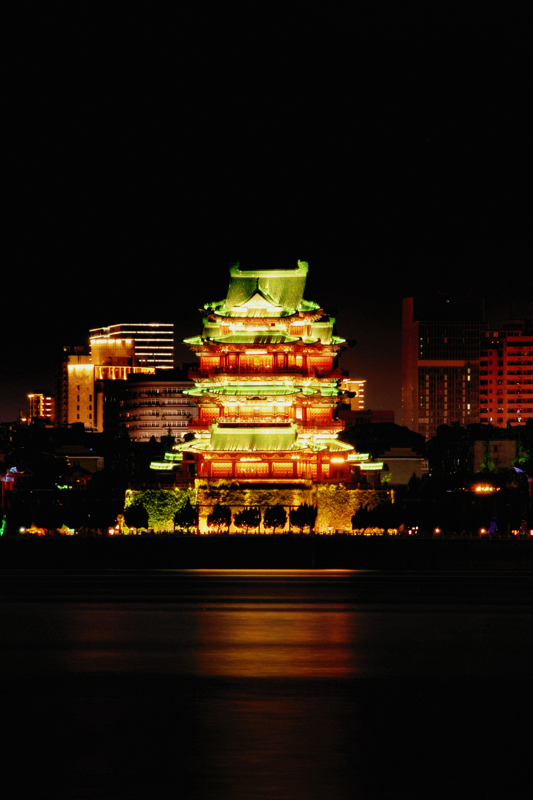
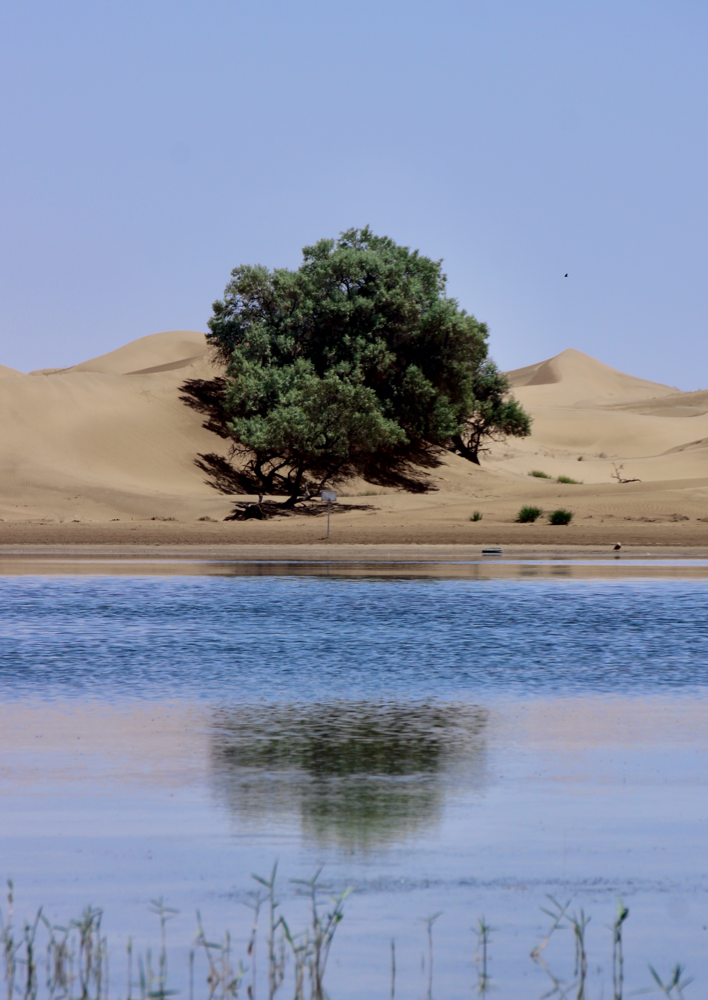

## At the Beginning
_"Image" captures the moments of life._ In my opinion, due to the aesthetics between different identities, there is not a single defination of the beauty of the images. Images often convey more than just the picture itself. They convey emotions, moods, and lifestyles. I have been a photographer since April, 2023. While traveling, I took photos to record different scenery, and also operated a Xiaohongshu account to take portraits. This section shows some of my landscape works.

### 1 Waterfall, 2024.08.07 Shoot at Wolong Valley, Wuyuan, Jiangxi Province

### 2 Tengwang Pavilion, 2024.08.02 Shoot at Nanchang, Jiangxi Province

### 3 Tree, 2024.06.07 Shoot at Tenggeli, Neimenggu

### 4 Peking CBD, 2024.10.19 Shoot at Beijing

